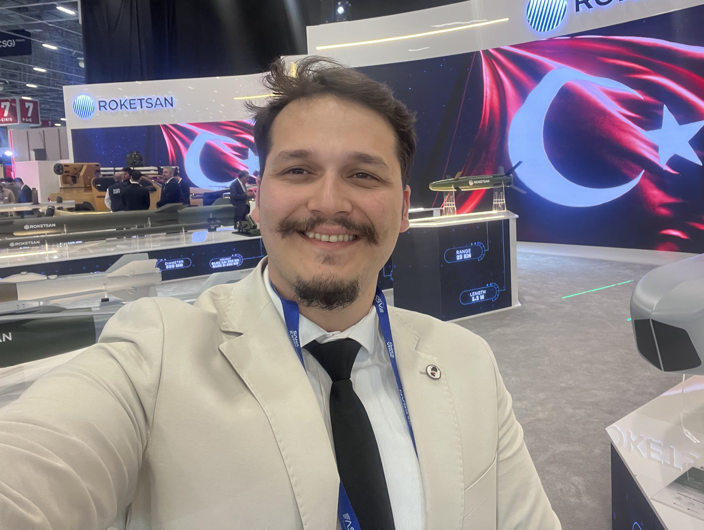

```{=html}
<div style="display:flex; align-items:center; gap:2rem; flex-wrap:wrap; margin-bottom:2rem;">
  
  <div>
    <h1 style="margin:0; font-size:2rem; font-weight:800; color:#3b0764;">Sertaç Eker</h1>
    <p style="margin:.4rem 0 .8rem; color:#6b7280; font-size:1rem;">
      Üretim & Test Mühendisi · İş Analitiği Yüksek Lisans Öğrencisi
    </p>
    <span class="hero-badge">📍 Ankara, Türkiye</span>
    <span class="hero-badge">🏭 Roketsan</span>
    <span class="hero-badge">🎓 Hacettepe Üniversitesi</span>
  </div>
</div>
```

> Metalürji mühendisliği temeli üzerine inşa edilen bir veri yolculuğu — savunma sanayiinden iş analitiğine.

------------------------------------------------------------------------

## 🎓 Eğitim

::::: info-card
::: info-card-title
Hacettepe Üniversitesi — Mühendislik Yönetimi (Yüksek Lisans)
:::

::: info-card-sub
2025 – Devam ediyor · Ankara · MÜY665 İş Analitiği
:::
:::::

::::: info-card
::: info-card-title
Gazi Üniversitesi — Metalürji ve Malzeme Mühendisliği (Lisans)
:::

::: info-card-sub
2017 – 2021 · Ankara
:::
:::::

------------------------------------------------------------------------

## 💼 İş Deneyimi

::::: info-card
::: info-card-title
Roketsan — Uzman Üretim ve Test Mühendisi
:::

::: info-card-sub
2023 – Devam ediyor · İnertial Measurement Unit alt bileşen geliştirme, fiber optik bobin iyileştirme (Six Sigma)
:::
:::::

::::: info-card
::: info-card-title
Er-Bakır Elektrolitik Bakır Ürünleri A.Ş. — Tel Çekme Uzman Mühendisi
:::

::: info-card-sub
2022 – 2023 · Üretim süreç optimizasyonu ve kalite yönetimi
:::
:::::

::::: info-card
::: info-card-title
Nurol Teknoloji A.Ş. — Seramik Üretim Mühendisi
:::

::: info-card-sub
2020 – 2022 · Zırh seramik üretimi ve malzeme geliştirme
:::
:::::

::::: info-card
::: info-card-title
Nurol Teknoloji A.Ş. — Stajyer Aday Mühendis
:::

::: info-card-sub
2020 · Üretim süreçlerine giriş stajı
:::
:::::

------------------------------------------------------------------------

## 🔬 Projeler

::::: info-card
::: info-card-title
%5 B₄C Katkılı Doğrudan Sinterleme SiC Zırh Malzemesi Geliştirme
:::

::: info-card-sub
Balistik performans araştırması ve malzeme karakterizasyonu
:::
:::::

::::: info-card
::: info-card-title
İki Aşamalı Sinterleme ile Tane Büyümesi Önleme
:::

::: info-card-sub
Mikroyapı kontrolü ve mekanik özellik iyileştirme
:::
:::::

::::: info-card
::: info-card-title
Sıvı Faz Sinterleme ile SiC Zırh Seramik Karo Üretimi
:::

::: info-card-sub
Alternatif sinterleme yöntemi araştırması
:::
:::::

::::: info-card
::: info-card-title
IMU Alt Bileşen İyileştirme Projesi (Six Sigma)
:::

::: info-card-sub
DMAIC metodolojisi ile süreç yeterliliği artırma · Roketsan
:::
:::::

::::: info-card
::: info-card-title
Fiber Optik Bobin İyileştirme Projesi (Six Sigma)
:::

::: info-card-sub
Sarım kalitesi ve sinyal performansı optimizasyonu · Roketsan
:::
:::::

------------------------------------------------------------------------

## 🛠 Yetkinlikler

```{=html}
<div style="margin: 1rem 0;">
  <strong style="color:#5b21b6; font-size:0.8rem; text-transform:uppercase; letter-spacing:.08em;">
    Programlama & Analitik
  </strong><br><br>
  <span class="skill-tag">R</span>
  <span class="skill-tag">Quarto</span>
  <span class="skill-tag">Git & GitHub</span>
  <span class="skill-tag">Minitab</span>
</div>
<div style="margin: 1rem 0;">
  <strong style="color:#5b21b6; font-size:0.8rem; text-transform:uppercase; letter-spacing:.08em;">
    Mühendislik Araçları
  </strong><br><br>
  <span class="skill-tag">AutoCAD</span>
  <span class="skill-tag">SAP</span>
  <span class="skill-tag">Oracle</span>
  <span class="skill-tag">Avix</span>
</div>
<div style="margin: 1rem 0;">
  <strong style="color:#5b21b6; font-size:0.8rem; text-transform:uppercase; letter-spacing:.08em;">
    Metodoloji
  </strong><br><br>
  <span class="skill-tag">Six Sigma (DMAIC)</span>
  <span class="skill-tag">İstatistiksel Proses Kontrol</span>
  <span class="